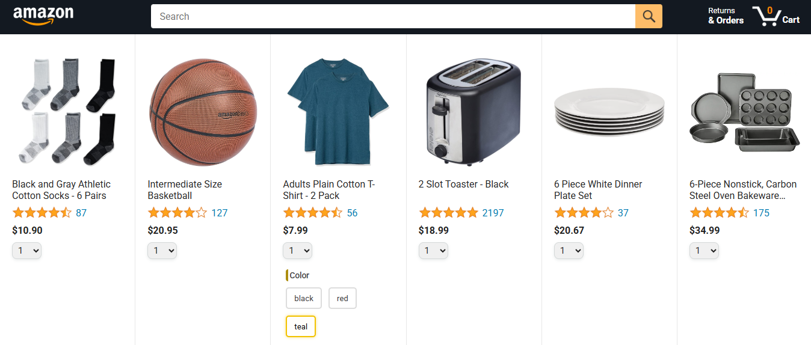
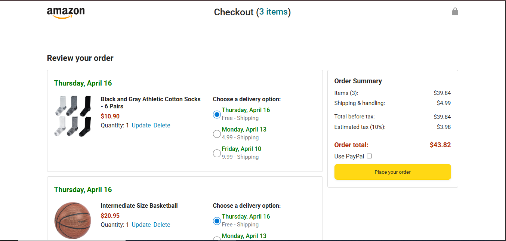
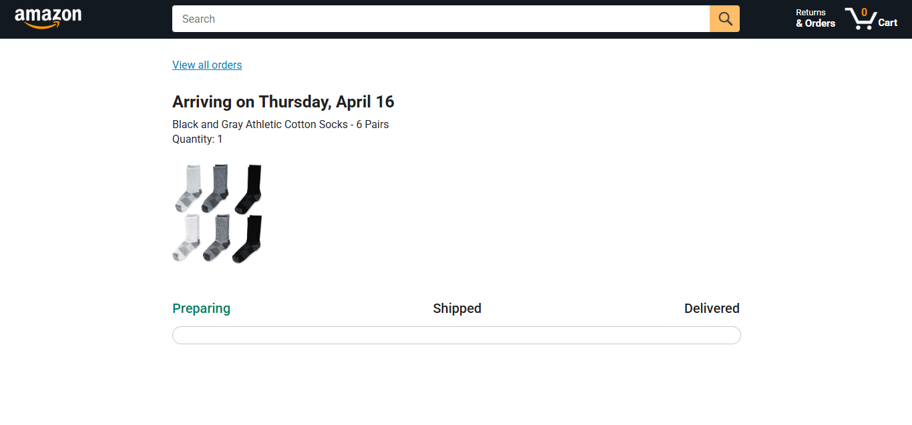

# Amazon Clone

This project is a static Amazon-inspired storefront built for front-end practice with vanilla HTML, CSS, and JavaScript. It includes a product listing page, checkout flow, orders page, and package tracking page, with shared navigation for search, cart, and order access. The app supports interactive cart actions such as searching products, selecting item options on supported products, updating quantities, choosing delivery options, and reviewing order progress.

## Features

- Multi-page shopping flow with dedicated product, checkout, orders, and tracking pages
- Product grid rendered from product data with ratings, pricing, quantity selection, and add-to-cart actions
- Search bar that filters products by updating the page query string
- Cart quantity badge in the header that updates as items are added
- Product option selection for supported items, including color and size buttons with active states
- Checkout page with order summary, quantity update, item removal, delivery option selection, and total calculation
- Empty cart state with a quick link back to the product page
- Order history page showing order date, total, order ID, product details, and a "Buy it again" action
- Tracking page with package progress states and a visual delivery progress bar
- Local storage persistence for cart, product option selections, tracking data, and saved orders

## Tech Used

- HTML
- CSS
- JavaScript
- CSS Grid and Flexbox for page layout and responsive sections
- Media queries for mobile-friendly product, checkout, orders, and tracking layouts
- Vanilla JavaScript ES modules, DOM rendering, `fetch`, and `localStorage`

## How to Run

Open `index.html` in your browser.

## Live Demo

[LiveDemo](https://kinkriashvilirati.github.io/Amazon-Copy/amazon.html)

## Screenshot

